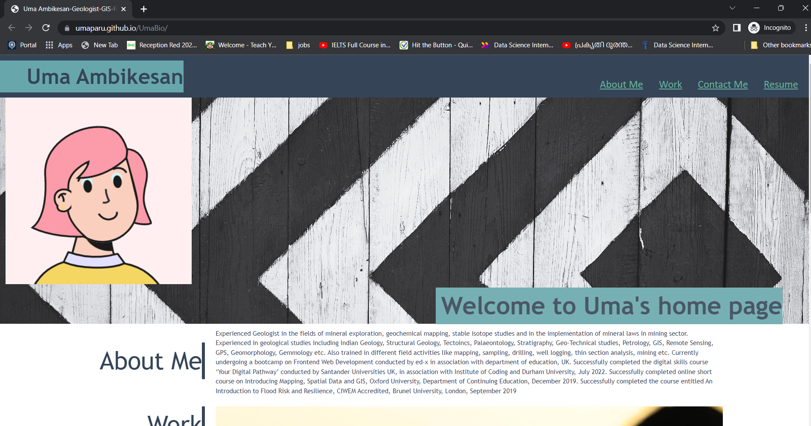
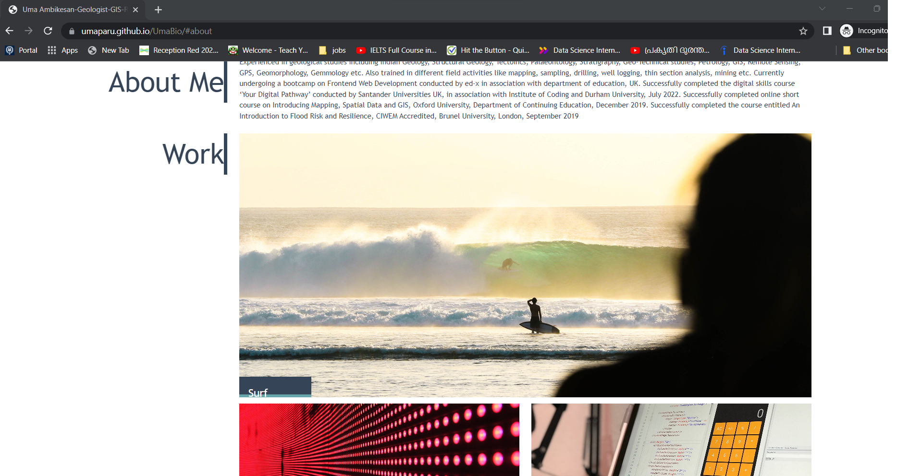
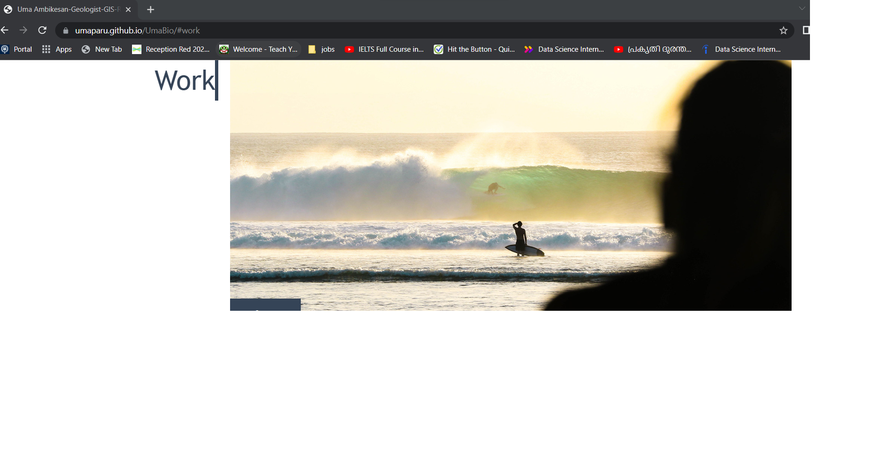
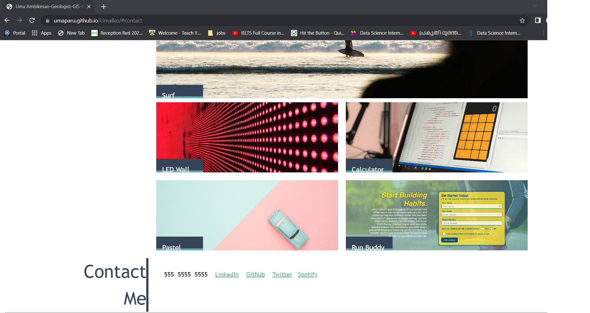

# Unit 2 Challenge: Portfolio

## Description

This is an html/css application to showcase simple Bio. Basic details about my bio and links to different different social media sites are also provided.

  ## Table of Contents
  1. [User-Story](#User-Story)
  2. [Mock-Up](#Mock-Up)
  3. [License](#License)
  4. [Questions](#Questions)
  
  
## User Story

Here are the critical requirements necessary to develop a portfolio that satisfies a typical hiring manager’s needs:

* When the page is loaded the page presents your name, a recent photo or avatar, and links to sections about you, your work, and how to contact you
* When one of the links in the navigation is clicked then the UI scrolls to the corresponding section
* When viewing the section about your work then the section contains titled images of your applications
* When presented with the your first application then that application's image should be larger in size than the others
* When images of the applications are clicked then the user is taken to that deployed application
* When the page is resized or viewed on various screens and devices then the layout is responsive and adapts to my viewport

## Mock-Up

The following animation shows the web application's appearance and functionality:

<h4>Home Page</h4>   

   

<h4>About </h4>   

  

<h4>Work Details</h4>   

   

<h4>Contact Details</h4>   

   

  ## License
 
  The MIT License 
  
  ## Questions  
  If you have queries please contact me using the below details  

  Github: <a href=https://github.com/umaparu>umaparu</a> 

  Email: mailto:uma@u.com